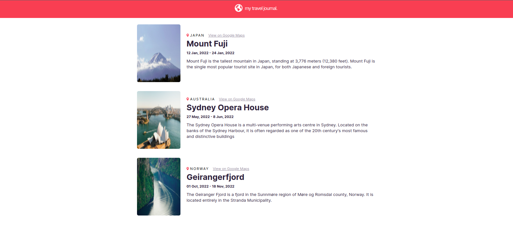

# Travel Journal.

## Welcome! 👋
This is a solo project given by Bob Ziroll to get our hands dirty on using props and javascript methods to populate the details of a component. In this project, we had to get data from a JSON file `data.js`, then with the use of props and .map(), the data was used to display the travel details!
## How To Run? 🤔
Download this code either as a `zip file` or use the `git clone` command to clone it.
Then, open the project folder in your editor and on the integrated terminal:
-  Run `npm install` to install all the packages used for this project.
After the installation,
- Run `npm start` to run the project on your browser localhost.
    That's all you'd need to do 🙂

## Have A Feedback? 
Giving feedback is appreciated, if you any to give on this project please email me at beatriceebirim@gmail.com.

**Happy Coding 💪**
